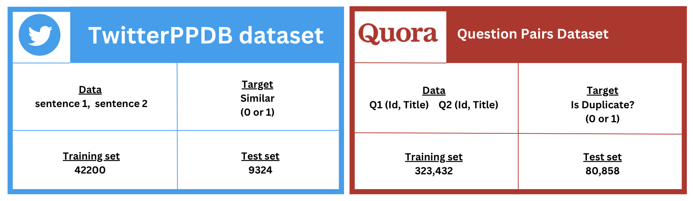
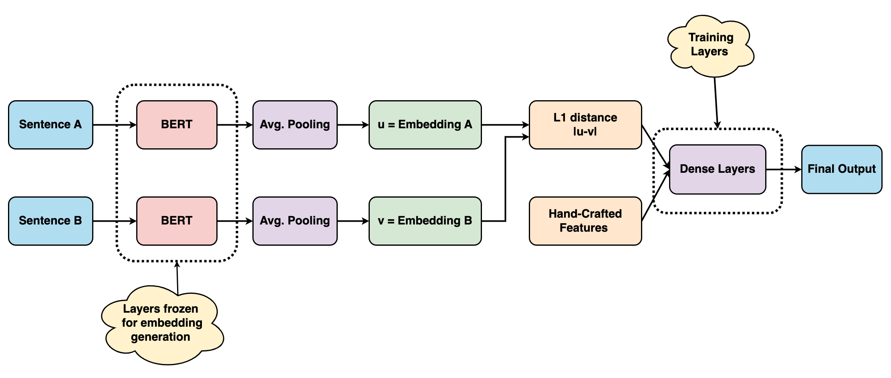
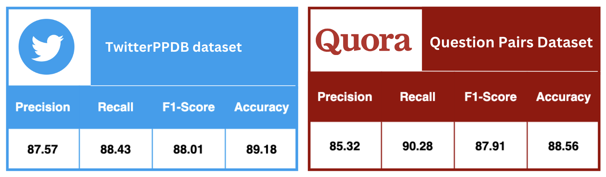

<h1>CSCI 544: Applied Natural Language Processing</h1>

<h2>ParaBERT: Paraphrase Identification using Siamese BERT and Hand Crafted Features</h2> 

 
  <table>
  <tr><h3><b>Group Number: 42</b></h3</tr>
  <tr>
  <td><b>Team Members</b></td><td>Kriti Asija</td><td>Parth Rohilla</td><td>Nishthavan Dahiya</td> <td>Darsh Patel</td><td>Soham Khade</td>
  </tr>
  </table>

  <h4><u>Professor</u>: <b>Mohammad Rostami</b></h4>

<h3><b>Abstract</b></h3>

&nbsp &nbsp &nbspParaphrase identification in today’s world is increasingly valuable, finding diverse applications across various fields, from
enhancing academic integrity to refining legal document analysis and boosting content originality in digital publishing. While there are many existing models for paraphrase detection, they typically focus
on word-level context, potentially missing sentence-level subtleties. This project
presents ”ParaBERT,” a novel approach
for paraphrase identification that combines
the strengths of a Siamese BERT network
with handcrafted features to get a more
nuanced understanding of semantics. To
evaluate the efficacy of ”ParaBERT”, it
is compared against a baseline of various classical models. The final results demonstrate the model’s robust performance, achieving high accuracy and F1-
scores on the datasets used.

<h3>Dataset</h3>
<!-- 
  -->

<h3>Proposed Model</h3>

<h3>Results</h3>

<!--   -->

<!-- 
<h4>TwitterPPDB Dataset</h4>
<table>
<tr><td>Data</td><td>sentence 1, sentence 2</td></tr>
<tr><td>Target</td><td>Similar (0 or 1)</td></tr>
<tr><td>Training Set</td><td>42200</td></tr>
<tr><td>Testing Set</td><td>9324</td></tr>
</table>
<h4>Quora Question Pairs Dataset</h4>
<table>
<tr><td>Data</td><td> Q1 (Id, Title),  Q2 (Id, Title)</td></tr>
<tr><td>Target</td><td>Is Duplicate? (0 or 1)</td></tr>
<tr><td>Training Set</td><td>323432</td></tr>
<tr><td>Testing Set</td><td>80858</td></tr>
</table>

<h3>Results</h3>
<h4>Quora Question Pairs Dataset</h4>
<table>
<tr><td>Precision</td><td>85.32</td></tr>
<tr><td>Recall</td><td>90.28</td></tr>
<tr><td>F1-Score</td><td>87.91</td></tr>
<tr><td>Accuracy</td><td>88.56</td></tr>
</table>
<h4>TwitterPPDB Dataset</h4>
<table>
<tr><td>Precision</td><td>87.57</td></tr>
<tr><td>Recall</td><td>88.43</td></tr>
<tr><td>F1-Score</td><td>88.01</td></tr>
<tr><td>Accuracy</td><td>89.18</td></tr>
</table>
 -->
